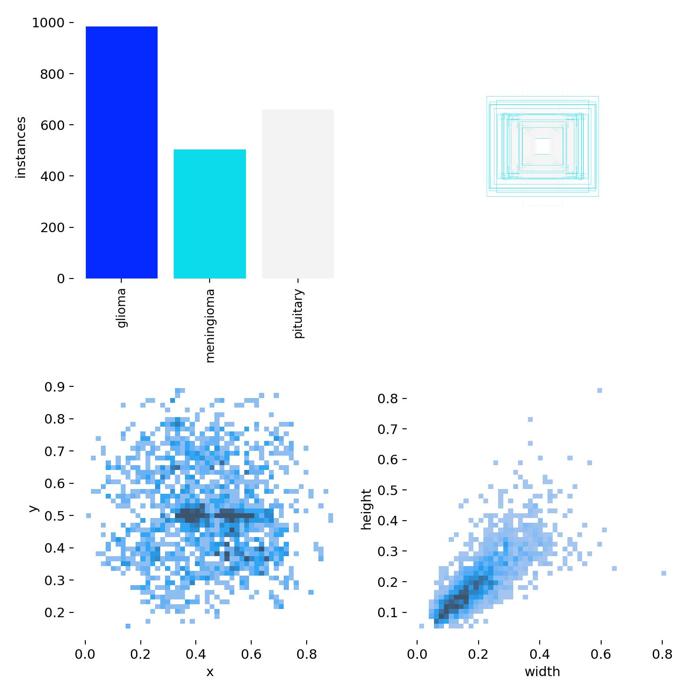

# Brain Tumor Detection Using YOLOv8s 

  A brain tumor detection algorithm developed using the YOLOv8s model. The project involved preparing and labeling medical imaging data, utilizing LabelMe for annotating the tumor regions. The YOLOv8s architecture was fine-tuned using the pretrained YOLOv8s model, to accurately detect and localize brain tumors within MRI scans. This algorithm aims to assist medical professionals by providing a fast and reliable tool for early diagnosis and treatment planning. 

